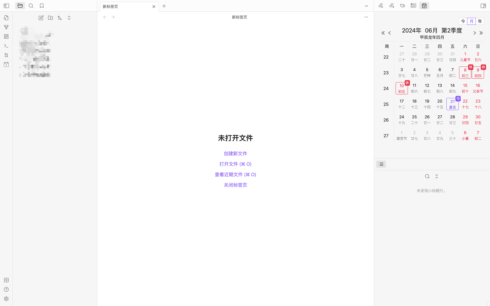
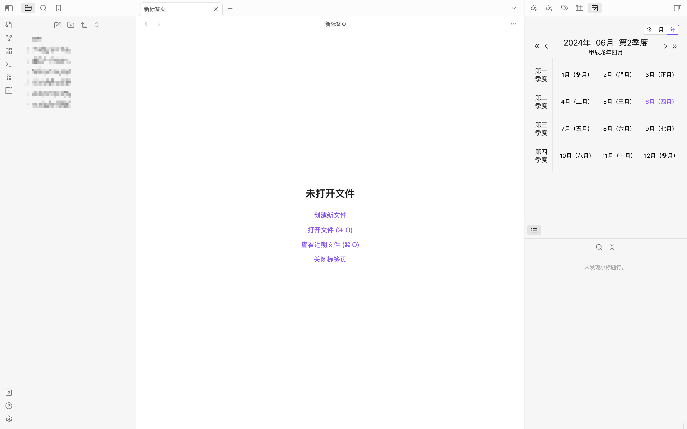
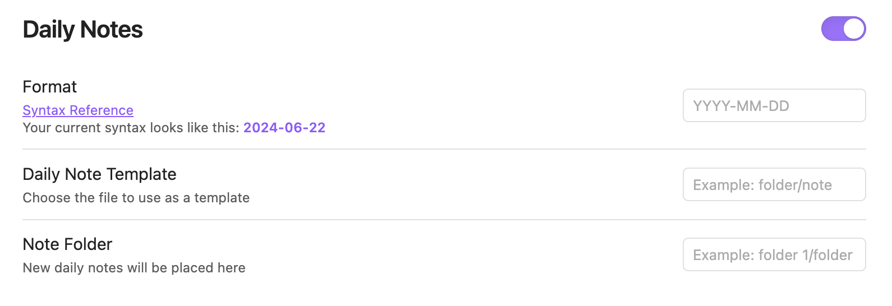
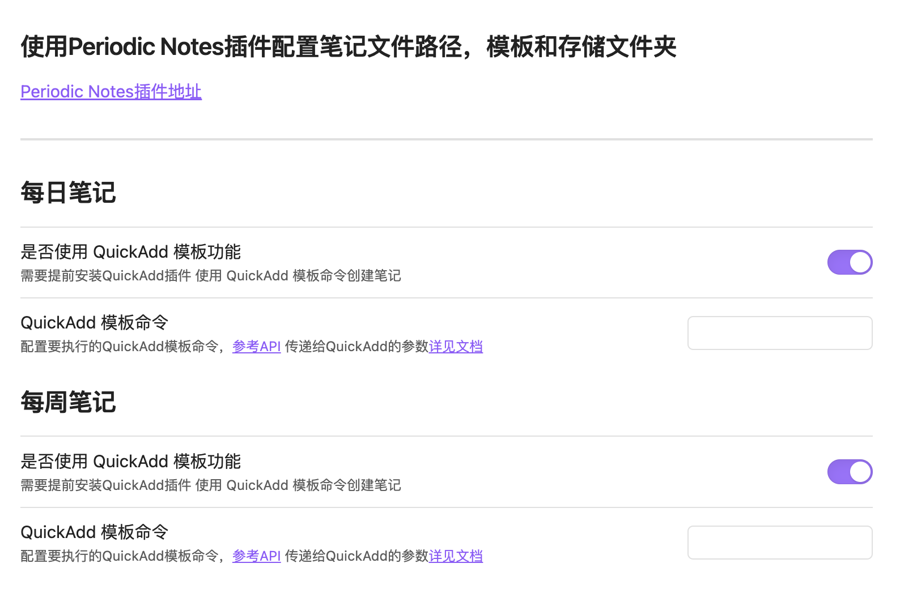

<h1 align="center">Chinese Calendar</h1>

    
    
    

更符合中国习惯的日历，可以显示农历、节日、调休、节气等信息，支持月视图和年视图切换，支持点击日期创建笔记，支持使用 QuickAdd 插件创建笔记。

## 更新日志

### 2024.07.31-V1.0.7

添加缩放功能，开启缩放功能配置，日历可以根据宽高进行等比例缩放。

### 2024.08.01-V1.0.8

修复本月点击上月日期顶部数据不更新的问题

### 2024.08.05-V1.0.9

修复农历节日不展示的问题

### 2024.08.05-V1.0.10

添加2025年法定节假日信息

## 插件简介

**本插件依赖插件 [Periodic Notes](obsidian://show-plugin?id=periodic-notes) 请提前安装并启用**

### 月视图

### 年视图

- 显示日历相关信息。
- 点击右上角切换月视图和年视图
- 点击左右切换上一月下一月上一年下一年。
- 点击年月日周和季度创建对应笔记（每日笔记、每周笔记、每月笔记、季度笔记、年度笔记）

## 插件设置

### Periodic Notes 配置

创建笔记相关的配置在插件 [Periodic Notes](obsidian://show-plugin?id=periodic-notes) 上进行设置，包括文件名语法，文件模板，笔记文件夹。

### 本插件设置页面

支持使用QuickAdd的模板功能创建笔记，需要传入对应的模板命令，[详见 QuickAdd 文档](https://quickadd.obsidian.guide/docs/QuickAddAPI#executechoicechoicename-string-variables-key-string-any-promise)

#### 支持传入QuickAdd命令的参数有：

可以通过模板嵌入字段语法使用，详见 [QuickAdd 文档](https://quickadd.obsidian.guide/docs/FormatSyntax)

##### 全笔记通用

- filename：文件名，即 Periodic Notes 中配置的文件名

##### 每日笔记

- chineseYear 农历年，例如：甲辰龙年
- chineseMonth 农历月
- chineseDay 农历日
- solarTerm 节气
- festivals 节日
- dateStr filename + 节日，例如：2024-06-01 儿童节
- lunar 农历年月日 + 节气，例如：甲辰龙年五月十六 夏至
- label 笔记种类，每日笔记

##### 每周笔记/每月笔记/季度笔记/年度笔记

- start 该周期第一天
- end 该周期最后一天
- label 笔记种类，每周笔记/每月笔记/季度笔记/年度笔记

## 安装

**本插件依赖插件 [Periodic Notes](obsidian://show-plugin?id=periodic-notes)  请提前安装并启用**

### 从 Obsidian 的社区插件来安装

1. 打开 `设置/第三方插件`；
2. 关闭 `安全模式`；
3. 点击 `浏览` 按钮来查看第三方插件市场；
4. 输入搜索：**Chinese Calendar**；
5. 点击 `安装` 按钮；
6. 激活插件然后启用。

### 手动安装

1. 打开 Obsidian 库中的插件目录 `<仓库根目录>/.obsidian/plugins/`。 （注意： `.obsidian` 文件夹可能被隐藏了，我们需要先将该文件夹展示出来）
2. 新建 chinese-calendar 文件夹。
2. 下载 [latest release](https://github.com/DevilRoshan/obsidian-lunar-calendar/releases/latest)，解压并提取内容到 chinese-calendar 文件夹中。（包含 main.js 和 manifest.json）
3. 打开 `设置/第三方插件`，启用该插件。（如果没有点击刷新或者重新加载obsidian）

## 特别感谢

感谢 a-nano-dust 的灵感

- 个人主页：https://github.com/a-nano-dust 
- 插件 dust-obsidian-calendar：https://github.com/a-nano-dust/dust-obsidian-calendar

感谢 liamcain 的插件和sdk

- 个人主页：https://github.com/liamcain
- 插件 Calendar：https://github.com/liamcain/obsidian-calendar-plugin
- 插件 Periodic Notes：https://github.com/liamcain/obsidian-periodic-notes
- sdk obsidian-daily-notes-interface：https://github.com/liamcain/obsidian-daily-notes-interface

